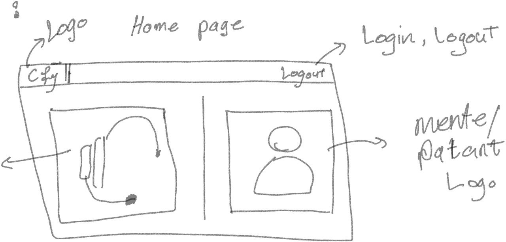
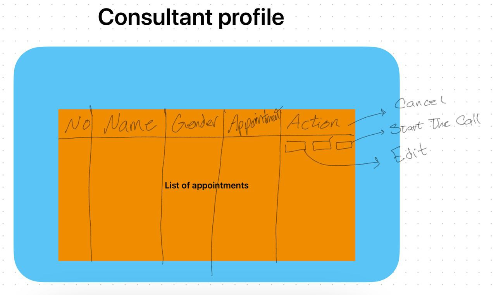
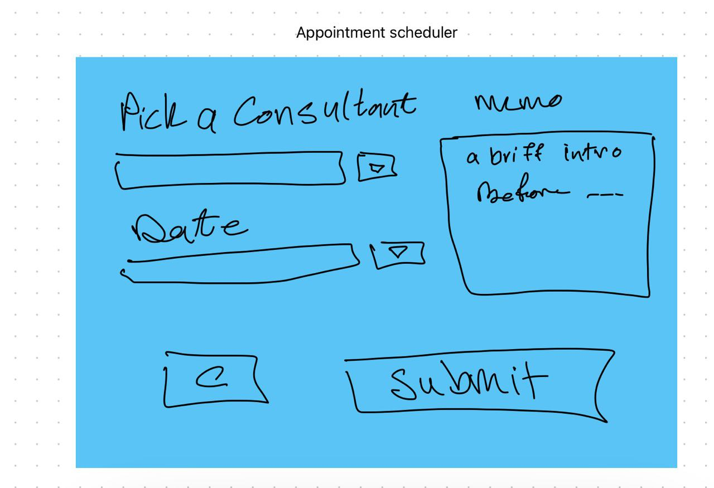
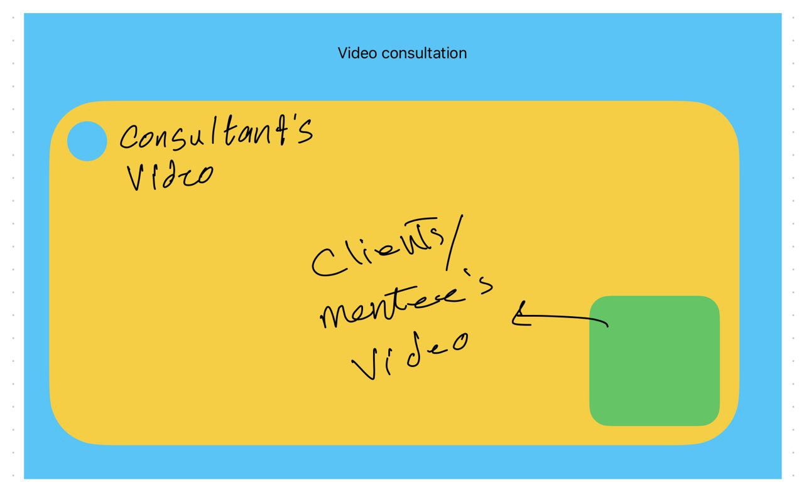

# Project Title
Consultify

## Overview

Consultify serves as a versatile platform connecting consultants with clients across various industries, offering real-time consultations, scheduling, and efficient communication channels.

### Problem

Accessing reliable consultancy services is often challenging due to geographical limitations and scheduling conflicts. Clients seek immediate advice and personalized assistance, while consultants struggle to reach a wider client base efficiently.

### User Profile

- **Consultants**:
  - Offer specialized services
  - Manage schedules and appointments
  - Engage in real-time consultations
- **Clients**:
  - Seek expert advice
  - Schedule consultations
  - Engage in real-time discussions with consultants

### Features

- **Client-Side**:
  - Find consultants based on expertise
  - Schedule appointments
  - Real-time chat with consultants via WebRTC
- **Consultant-Side**:
  - Profile creation with expertise listing
  - Availability calendar
  - Accept/Reject appointments
  - Video consultations with clients

### Tech Stack

- **Frontend**:
  - React
  - SCSS for styling
  - Axios for API calls
- **Backend**:
  - Node.js with Express
  - MySQL for database
  - Knex.js for query building
  - JWT for authentication
  - WebRTC for real-time video consultations
  - Socket.IO

### APIs

- No external APIs will be used initially

### Sitemap

- Home
- Client Dashboard
- Consultant Dashboard
- Appointment Scheduler
- Video Consultation
- Sign in and Sign up

### Mockups

#### Home Page

#### Consultant Profile

#### Appointment Scheduler

#### Video Consultation

### Data Structure

- **Users Table**:
  - id
  - username
  - email
  - password
  - role (consultant or client)
- **Appointments Table**:
  - client_id
  - consultant_id
  - date_time
  - status

### Endpoints

**POST /users/register**

- Register a new user

**POST /users/login**

- Login a user

**GET /consultants**

- Get list of available consultants

**POST /appointments/book**

- Book an appointment with a consultant

**WS /video/connect**

- Initiate a WebRTC connection for video consultation

### Authentication

- JWT-based authentication for user login and session management

## Roadmap

- Setup frontend and backend projects
- Create user authentication endpoints
- Develop consultant and client profiles
- Implement consultant search and appointment scheduling features
- Implement real-time video consultations using WebRTC
- Testing and bug fixes
- Deployment and production-ready setup

## Potential Future Additions

- **Payment Integration**: Integrate a secure payment gateway for transactions
- **Review and Rating System**: Enable users to provide feedback on consultations
- **Enhanced User Profile Customization**: Provide additional options for user profile personalization
- **Multi-language Support**: Expand accessibility through multiple language options

This proposal aims to create an adaptable and user-friendly consulting platform, facilitating efficient communication, scheduling, and consultations between consultants and clients. While the initial focus is on core functionalities, the potential future additions pave the way for a more comprehensive and feature-rich platform.

# Installation

1. Update `/server/knexfile.js` with your database credentials.

2. Create a database called `consultify`, or update `/server/knexfile.js` with the name of a newly created database of your choosing.

3. Open two terminals.

4. In first terminal, run:
    - `cd client`
    - `npm i`
    - `npm run build`

5. In second terminal, run:
    - `cd server`
    - `npm i`
    - `npm run migrate`
    - `npm run dev`